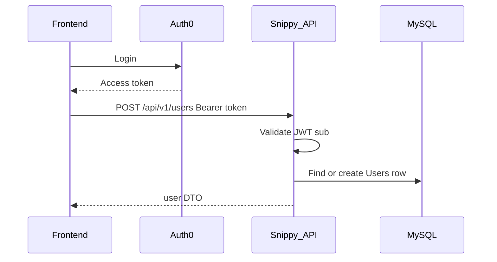

# Snippy Backend Architecture & API Documentation

## Table of Contents

1. [Overview](#overview)
2. [Tech Stack](#tech-stack)
3. [Architecture Layers](#architecture-layers)
4. [How to add a module](#how-to-add-a-module)
5. [Startup Workflow](#startup-workflow)
6. [Database Schema](#database-schema)
7. [Authentication & Authorization](#authentication--authorization)
8. [Middleware](#middleware)
9. [Common Response Shapes](#common-response-shapes)
10. [Pagination](#pagination)
11. [API Quick Reference](#api-quick-reference)
12. [Detailed API Endpoints](#detailed-api-endpoints)
13. [End-to-End Workflows](#end-to-end-workflows)
14. [Environment Variables](#environment-variables)
15. [Operational Notes](#operational-notes)
16. [OpenAPI / SPA client](#openapi--spa-client)
17. [Debugging](#debugging)

---

## Overview

The Snippy backend is a Node.js / Express REST API that powers a CodePen-like product: users authenticate with Auth0, create HTML/CSS/JS snippets, fork and favorite pens, comment, and optionally upload image assets to MinIO for use as URLs inside snippet HTML/CSS.

**Base URL:** `/api/v1`

**Modules:**

| Module | Mount | Responsibility |
|--------|-------|----------------|
| User | `/users` | Ensure/create profile, update (incl. privacy + editorPreferences), delete, username check, follow graph |
| Snippet | `/snippets` | CRUD, fork, forks list, search, feed, views, embed, public/private |
| Comment | `/comments` | CRUD, one-level replies, @mentions (display) |
| Favorite | `/favorites` | List, status check, toggle |
| Collection | `/collections` | CRUD collections + ordered pens |
| Asset | `/assets` | MinIO asset list / upload / delete |

**Deployment:**

- **Local development:** root [`docker-compose.yml`](../docker-compose.yml) builds `snippy/backend/Dockerfile.dev` with hot reload (`npm run dev`)
- **Production images:** GitHub Actions builds `snippy/backend/Dockerfile` and pushes to Docker Hub (`kennyl777/snippy-api`)

---

## Tech Stack

| Concern | Choice |
|---------|--------|
| Runtime | Node.js 20 |
| Framework | Express 5 |
| Language | TypeScript |
| ORM / DB | Sequelize-TypeScript + MySQL 8 |
| Auth | Auth0 JWT via `express-oauth2-jwt-bearer` (RS256) |
| Validation | Joi + DOMPurify sanitization |
| Object storage | MinIO (optional, feature-flagged) |
| Uploads | Multer (memory storage) |
| Security | Helmet, CORS, express-rate-limit |
| Logging | Winston-based custom logger |
| API docs (dev) | Swagger UI at `/api-docs` (non-production) |

---

## Architecture Layers

```
Client
  → Middleware (cookie, helmet, CORS, rate limit, Auth0 JWT, JSON body)
  → /api/v1 router
  → Module router + per-route limiter
  → Controller (Joi validate)
  → Service (business rules, ownership, transactions)
  → Repository (Sequelize queries)
  → Entity / MySQL
  ← Mapper → DTO JSON { success: true, ... }
  ← Error handler { success: false, error }
```

### Responsibility breakdown

| Layer | Location | Role |
|-------|----------|------|
| Routes | `modules/*/*.routes.ts` | HTTP method/path + rate limiter |
| Controller | `modules/*/*.controller.ts` | Validate input, call service, send JSON status |
| Validator | `modules/*/*.validator.ts` | Joi schemas + sanitize user text |
| Service | `modules/*/*.service.ts` | AuthZ, privacy, orchestration, transactions |
| Repository | `modules/*/*.repo.ts` | Sequelize CRUD / queries |
| Mapper | `modules/*/*.mapper.ts` | Entity → DTO |
| Entity | `entities/*.entity.ts` | Table definitions and associations |
| Common | `common/` | Auth, errors, pagination, rate limit, logger |

**Do not leak Sequelize entities to clients.** Always return mapped DTOs.

Mappers exist when the module owns a client JSON shape. If it does not return its own table row, reuse another mapper: favorite lists use `SnippetMapper`; follow lists use `UserMapper`; favorite toggle uses a small `FavoriteMapper` (`isFavorited` / `favoriteCount`). Extra repos are only for a second table (e.g. `snippetView.repo.ts`). Follow routes stay on `user.routes.ts`.

OpenAPI is defined in [`common/utilities/openapi-definition.ts`](../snippy/backend/src/common/utilities/openapi-definition.ts). See [OpenAPI / SPA client](#openapi--spa-client).

---

## How to add a module

Use **collection** (`modules/collection/`) as the canonical full module. Follow lives on `user.routes.ts` instead of its own router; extra tables (e.g. `snippetView.repo.ts`) are repos, not new modules.

**Runtime (always):**

1. Entity in `src/entities/` plus associations on related entities.
2. Register the model in [`sequelize.addModels`](../snippy/backend/src/database/sequelize.ts).
3. Migration `src/database/migrations/<timestamp>-NNN-descriptive.js` with `up` / `down`. Use **`.js`**, not `.ts` (`tsc` would compile a TypeScript migration).
4. `dto/`, `validator.ts`, `repo.ts`, `service.ts`, `controller.ts`, and `mapper.ts` if you own a JSON shape. Reuse another mapper if you only return someone else’s DTO.
5. `*.routes.ts` with `publicReadLimiter` / `writeLimiter`, **or** attach routes to an existing router.
6. Mount in [`src/routes/routes.ts`](../snippy/backend/src/routes/routes.ts) unless nested.
7. Unauthenticated GET: add a path pattern in [`optional-jwt.ts`](../snippy/backend/src/common/middleware/optional-jwt.ts) (plus tests). Do **not** open `/me`, `/feed`, `/users/me`, or favorites.
8. Controllers: Joi in the controller, `CustomError`, mapped DTOs only, `{ success: true, ... }` or **204** on delete.
9. Tests next to the module when behavior is non-trivial. Add the module to this doc’s Overview table and API quick reference.

**OpenAPI / SPA — required when the HTTP contract changes** (new paths, methods, query/path params, bodies, status codes, DTO fields, `operationId`s):

1. Update [`openapi-definition.ts`](../snippy/backend/src/common/utilities/openapi-definition.ts) (`components.schemas` + `paths`) to match DTOs/mappers. Mark public GETs `security: []`. Controller `@swagger` JSDoc is **not** the spec (`swagger-jsdoc` is unused).
2. From `snippy/backend`: `npm run openapi:export`
3. From `snippy/frontend`: `npm run openapi:generate`
4. Commit both `openapi.json` files and `frontend/src/app/api/generated/`

Skip export/generate only when handler/SQL change and the JSON/routes/`operationId`s are unchanged. The SPA never imports backend TypeScript DTOs.

```
entity + migration
  → dto / validator / repo / service / controller / routes
  → routes.ts + optional JWT
  → openapi-definition.ts
  → npm run openapi:export
  → npm run openapi:generate
```

---

## Startup Workflow

Source: [`snippy/backend/src/index.ts`](../snippy/backend/src/index.ts)

1. `validateConfig()` — requires `AUTH0_DOMAIN` and `DB_PASS`
2. Create Express app (`trust proxy = 1`)
3. Mount middleware stack (see [Middleware](#middleware))
4. Mount `/api/v1` routes
5. Mount global error handler
6. Connect MySQL + run pending Sequelize migrations — **required**; failure exits process
7. If `ENABLE_MINIO=true`, attempt MinIO connect/bucket check and set `featureFlags.isMinioAvailable`
8. Listen on `PORT` (default `3000`)

MinIO failure does **not** stop the API. Asset / picture / snapshot endpoints return **503** when MinIO is unavailable. A later **connection** error (refused, DNS, timeout) latches `isMinioAvailable` to `false` until the API process restarts — it does not flip back on its own.

---

## Database Schema

Schema is defined by Sequelize entities and applied via **migrations** on API boot (`runMigrations` in [`src/database/migrate.ts`](../snippy/backend/src/database/migrate.ts)). Migration files live in [`src/database/migrations/`](../snippy/backend/src/database/migrations/). [`snippy/db/init.sh`](../snippy/db/init.sh) only creates the database/user grants.

### Entity relationships

```
Users (PK: auth0_id)
  ├── HasMany Snippets
  ├── HasMany Comments
  ├── HasMany Favorites
  ├── HasMany Assets
  ├── HasMany Collections
  └── Follows (follower / following)

Snippets (PK: snippet_id UUID; unique short_id 7 chars)
  ├── BelongsTo Users (auth0_id, CASCADE)
  ├── BelongsTo parent Snippet via parent_snippet_short_id → short_id (no DB FK)
  ├── HasMany SnippetFiles (unique snippet_id + file_type)
  ├── HasMany Comments
  ├── HasMany Favorites
  ├── HasMany SnippetViews (unique snippet_id + auth0_id)
  └── BelongsToMany Collections via collection_snippets

SnippetFiles — html | css | js content per snippet
Comments    — BelongsTo Users + Snippets
Favorites   — unique (auth0_id, snippet_id)
SnippetViews — dedupe ledger; unique (snippet_id, auth0_id); last_viewed_at
Follows     — unique (follower_auth0_id, following_auth0_id)
Collections — short_id; is_private; collection_snippets (position)
Assets      — BelongsTo Users; unique (auth0_id, object_key)
```

### Entity field highlights

#### Users

| Field | Notes |
|-------|--------|
| `auth0Id` | PK = Auth0 JWT `sub` |
| `userName` | Unique; auto-generated on create if needed |
| `displayName`, `bio`, `pictureUrl` | Profile |
| `isAdmin` | Column kept (`is_admin`) but **unused** — reserved for a future moderation UI. Not returned on DTOs. New users are created with `false`. |
| `isPrivate` | Private profiles return 403 to non-owners |
| `editorPreferences` | JSON (`editor_preferences`); null → merged defaults on owner responses |

#### Snippets

| Field | Notes |
|-------|--------|
| `snippetId` | UUID — used for update/delete/fork/view/favorites/comments |
| `shortId` | 7-char public id — used for GET by shortId |
| `parentShortId` | Fork parent link |
| `isPrivate` | Owner-only for non-owners |
| Counters | `viewCount`, `forkCount`, `favoriteCount`, `commentCount` (denormalized) |
| `tags` | JSON string array |
| `cdnResources` | JSON array of `{ resourceType: 'css'\|'js'\|'other', url }` |
| `snapshotUrl` | MinIO preview JPEG path (`/content/...`) or null |

#### SnippetViews

| Field | Notes |
|-------|--------|
| `snippetViewId` | UUID PK |
| `snippetId` + `auth0Id` | Unique pair — one row per viewer per snippet |
| `lastViewedAt` | Last time a view was counted for this pair |

#### Follows

| Field | Notes |
|-------|--------|
| `followId` | UUID PK |
| `followerAuth0Id` / `followingAuth0Id` | Unique pair; CASCADE on user delete |

#### Collections

| Field | Notes |
|-------|--------|
| `collectionId` | UUID — mutations |
| `shortId` | Public id for GET |
| `isPrivate` | Owner-only when private |
| `collection_snippets` | Ordered membership (`position`); public pens or owner’s own pens |

#### SnippetFiles

| Field | Notes |
|-------|--------|
| `fileType` | ENUM `html` \| `css` \| `js` |
| `content` | Source text (not HTML-sanitized) |

#### Assets (MinIO metadata)

| Field | Notes |
|-------|--------|
| `assetId` | UUID — delete by this id |
| `objectKey` | Unencoded MinIO key (`{auth0Sub}/{subFolder}/{fileName}`) |
| `url` | Public path `/content/{segment-encoded-objectKey}` |
| `fileName`, `fileType` | Original name + MIME |

Assets are **user-scoped**, not linked to snippets in the DB. Snippets embed asset URLs in HTML/CSS content. `GET /assets` and owner `UserDTO.assets` omit `profile/` and `snippets/` prefixes (avatars and list snapshots). Those prefixes skip `assets` rows on upload.

---

## Authentication & Authorization

### Public routes (no JWT)

| Path | Purpose |
|------|---------|
| `GET /health` | Liveness probe — `{ status: "ok", minio: boolean }` |
| `GET /ready` | Readiness probe — pings MySQL (and MinIO when enabled) |
| `GET /api/v1/health` | Same liveness body, public (no JWT) — SPA reads this through nginx `/api/` |
| `GET /api/v1/ready` | Same readiness body |
| `GET /api/v1/snippets/:shortId` | Public snippet GET — JWT optional (identity attached when present) |
| `GET /api/v1/snippets/:shortId/embed` | Runnable HTML for **public** pens (iframe-friendly) |
| `GET /api/v1/snippets/:shortId/forks` | Paginated fork children — JWT optional |
| `GET /api/v1/snippets/shared/:token` | Secret share-link load — JWT optional |
| `GET /api/v1/snippets/public` | Paginated public explore list — JWT optional |
| `GET /api/v1/snippets/search` | Public search — JWT optional |
| `GET /api/v1/snippets/user/:userName` | A user's public pens — JWT optional |
| `GET /api/v1/users/:userName` | Public profile (`/users/me` still requires JWT) |
| `GET /api/v1/collections/:shortId` | Public collection detail (`/collections/me` still requires JWT) |
| `GET /api/v1/collections/user/:userName` | A user's public collections |
| `GET /api/v1/comments/:snippetId` | Comment list on a pen — JWT optional |
| `/api-docs` | Swagger UI (non-production only); spec at `/api-docs.json` |

### Auth0 JWT (`/api/v1/*`)

Every request under `/api/v1` requires a valid Bearer token **except** the public GET routes above. Personal feeds (`/snippets/feed`, `/snippets/me`, `/collections/me`, `/users/me`, favorites) and **all writes** still require a JWT.

```
Authorization: Bearer <access_token>
```

Configured in `common/middleware/auth0.service.ts`:

- Audience: `AUTH0_AUDIENCE` (default `http://localhost:3000`)
- Issuer: `https://${AUTH0_DOMAIN}/`
- Algorithm: RS256

User identity: `req.auth.payload.sub` → `auth0Id`.

Aside from the public GET carve-outs above, clients must send a JWT for personal feeds and mutations.

### Ownership

`AuthorizationService.verifyOwnership` throws **403** when the caller is not the resource owner (snippets, comments, collections, profile mutations). Snippet owners may also **delete** comments on their pens.

### Privacy rules

| Resource | Non-owner behavior |
|----------|--------------------|
| Private user profile | 403 on `GET /users/:userName`, pens list, collections list, followers/following |
| Private snippet | 403 on GET by shortId, view, comment, favorite (unless owner); embed → 404 |
| Public snippet / profile | Allowed for any authenticated user |
| `GET /snippets/user/:userName` | Public pens only; **403** if profile is private (non-owner) |
| Follow | Cannot follow private profiles; self-follow rejected |
| Private collection | Owner only |

---

## Middleware

Order in `index.ts`:

1. Cookie parser
2. Helmet
3. CORS (`FRONTEND_URL`, credentials, `Authorization` + `X-Request-Id`)
4. Global rate limiter (200 / 15 min)
5. `express.json({ limit: '2mb' })` — snippet HTML/CSS/JS bodies can exceed the Express 100kb default
6. Request ID + request log (`X-Request-Id`)
7. Auth0 JWT check
8. `/api/v1` routers (with per-route limiters)
9. Error handler

### Rate limiters (`rate-limit.service.ts`)

| Limiter | Max / 15 min | Used for |
|---------|--------------|----------|
| `globalLimiter` | 200 | All requests |
| `publicReadLimiter` | 150 | GET routes |
| `writeLimiter` | 50 | Mutations including `POST /users/picture` |
| `authLimiter` | 20 | `POST /users` |
| `searchLimiter` | 60 | `GET /snippets/search` |

---

## Common Response Shapes

### Success

```json
{ "success": true, "...": "payload fields" }
```

### Error

```json
{ "success": false, "error": "Human-readable message" }
```

### Typical status codes

| Code | Meaning |
|------|---------|
| 200 | OK (including favorite toggle) |
| 201 | Created |
| 204 | Deleted (empty body) — snippets, assets, users, collections, comments, share-link revoke |
| 400 | Validation / bad input |
| 401 | Missing/invalid JWT |
| 403 | Forbidden (ownership or private resource) |
| 404 | Not found |
| 429 | Rate limited |
| 500 | Unexpected server error |
| 503 | MinIO unavailable (asset routes, `POST /users/picture`) |

---

## Pagination

Query params on list endpoints:

| Param | Default | Max |
|-------|---------|-----|
| `page` | `1` | — |
| `limit` | `10` | `100` |

Implemented by `PaginationService` (`common/services/pagination.service.ts`).

List responses include `totalCount` (total matching rows, not just page size).

---

## API Quick Reference

All paths are under `/api/v1`. All require `Authorization: Bearer …`.

### Users

| Method | Path | Description |
|--------|------|-------------|
| GET | `/users/check-username/:userName` | Username available? |
| GET | `/users/me` | Current user (owner fields + follow counts) |
| GET | `/users/:userName` | Public profile (+ `isFollowing`, follow counts) |
| GET | `/users/:userName/followers` | Paginated followers |
| GET | `/users/:userName/following` | Paginated following |
| POST | `/users/:userName/follow` | Follow user |
| DELETE | `/users/:userName/follow` | Unfollow user |
| POST | `/users` | Ensure / create user from Auth0 |
| PUT | `/users` | Update own profile |
| DELETE | `/users` | Delete own account |

### Snippets

| Method | Path | Description |
|--------|------|-------------|
| GET | `/snippets/search` | Search public snippets (`q`, `sort`, `tag`) |
| GET | `/snippets/public` | Paginated public list (`sort`, `tag`) |
| GET | `/snippets/feed` | Public pens from followed users |
| GET | `/snippets/me` | Current user’s snippets (incl. private) |
| GET | `/snippets/user/:userName` | User’s public snippets (profile privacy enforced) |
| GET | `/snippets/:shortId/embed` | **Public** runnable HTML (no JWT) |
| GET | `/snippets/:shortId/forks` | Paginated children (public-safe) |
| GET | `/snippets/:shortId` | Full snippet by short id |
| POST | `/snippets` | Create |
| POST | `/snippets/fork/:snippetId` | Fork by UUID |
| PUT | `/snippets/:snippetId` | Update (owner) |
| POST | `/snippets/:snippetId/view` | Record unique view (owner skipped; 24h cooldown) |
| DELETE | `/snippets/:snippetId` | Delete (owner) |

`sort`: `newest` (default) \| `views` \| `favorites` \| `forks`. List DTOs include `isFavorited` when authenticated.

### Comments

| Method | Path | Description |
|--------|------|-------------|
| GET | `/comments/:snippetId` | List comments |
| POST | `/comments/:snippetId` | Create comment |
| PUT | `/comments/:commentId` | Update own comment |
| DELETE | `/comments/:commentId` | Delete (author **or** snippet owner) |

### Favorites

| Method | Path | Description |
|--------|------|-------------|
| GET | `/favorites` | List favorited snippets |
| GET | `/favorites/:snippetId` | Is favorited? |
| POST | `/favorites/:snippetId` | Toggle favorite |

### Collections

| Method | Path | Description |
|--------|------|-------------|
| GET | `/collections/me` | My collections |
| GET | `/collections/user/:userName` | User’s public collections |
| GET | `/collections/:shortId` | Collection + ordered pens |
| POST | `/collections` | Create |
| PUT | `/collections/:collectionId` | Update meta (owner) |
| DELETE | `/collections/:collectionId` | Delete (owner) |
| POST | `/collections/:collectionId/snippets` | Add pen `{ snippetId }` |
| DELETE | `/collections/:collectionId/snippets/:snippetId` | Remove pen |
| PUT | `/collections/:collectionId/snippets/order` | Reorder `{ snippetIds }` |

### Assets (MinIO)

| Method | Path | Description |
|--------|------|-------------|
| GET | `/assets` | List my assets |
| POST | `/assets` | Upload file (`multipart`) |
| DELETE | `/assets/:assetId` | Delete asset by UUID |

---

## Detailed API Endpoints

### DTOs (reference)

These TypeScript DTOs (under `modules/*/dto/`) plus mappers are the **API JSON contract**. Express controllers return `Promise<void>` and `res.json(...)`; they do not share a compile-time package with the Angular SPA. After you change routes or JSON shapes, regenerate the SPA client ([OpenAPI / SPA client](#openapi--spa-client)). See also [frontend contracts](./frontend.md#contracts-spa-vs-api).

**UserDTO**

```ts
{
  userName: string;
  displayName: string | null;
  bio: string | null;
  pictureUrl: string | null;
  isPrivate?: boolean;    // owner responses only
  editorPreferences?: EditorPreferences; // owner responses only; always merged with defaults
  isFollowing?: boolean;  // when viewing another user
  followerCount?: number;
  followingCount?: number;
  assets?: AssetDTO[];
}
```

Defaults and allowlists live in [`common/utilities/editor-preferences.ts`](../snippy/backend/src/common/utilities/editor-preferences.ts) (`DEFAULT_EDITOR_PREFERENCES`, `EDITOR_THEME_KEYS`, `EDITOR_FONT_KEYS`). Keep theme keys in sync with the frontend registry when adding themes.
**AssetDTO**

```ts
{
  assetId: string;
  fileName: string;
  fileType: string;
  url: string;
  objectKey?: string;
  usedInCount?: number;
}
```

**SnippetDTO** — full pen (includes files + CDN libraries)  
**SnippetListDTO** — list card fields (no files); includes `isFavorited?`  
**CommentDTO** — `commentId`, `content`, `userName?`, `displayName?`, `isOwner`, timestamps  
**CdnResource** — `{ resourceType: 'css' | 'js' | 'other', url: string }`  
**CollectionDTO** — `collectionId`, `shortId`, `name`, `description`, `isPrivate`, `isOwner`, optional `snippets` / `snippetCount`

---

### User endpoints

#### `GET /users/check-username/:userName`

**Response `200`:** `{ success: true, available: boolean }`

#### `GET /users/me`

Returns the authenticated user’s profile including `isPrivate`, `editorPreferences` (merged with defaults), `followerCount`, `followingCount`, and `assets`.

**Response `200`:** `{ success: true, user: UserDTO }`

#### `GET /users/:userName`

Public profile. Returns **403** if the profile is private and the caller is not the owner. Includes `followerCount`, `followingCount`, and `isFollowing` when viewing another user.

**Response `200`:** `{ success: true, user: UserDTO }` (without owner-only flags unless self)

#### `POST /users/:userName/follow`

Follow a public profile. Self-follow → 400. Private target → 403. Idempotent if already following.

**Response `200`:** `{ success: true, message, isFollowing: true }`

#### `DELETE /users/:userName/follow`

**Response `200`:** `{ success: true, message, isFollowing: false }`

#### `GET /users/:userName/followers` / `GET /users/:userName/following`

Paginated. Private profile → 403 for non-owners.

**Response `200`:** `{ success: true, users: UserDTO[], totalCount: number }`

#### `POST /users` — Ensure user

Called after Auth0 login to create the DB row if missing, or sync allowed profile fields.

**Body:**

```json
{
  "name": "Optional Display Name",
  "pictureUrl": "https://..."
}
```

- Username may be auto-generated from adjective+noun helper
- Existing users: Auth0 `pictureUrl` is **not** applied when the stored value already starts with `/content/` (MinIO avatar). First-time create still uses the Auth0 picture.

**Response:** `200` (existing) or `201` (created) — `{ success: true, user: UserDTO }` (owner fields including merged `editorPreferences`)

#### `PUT /users`

**Body (all optional):**

```json
{
  "userName": "string",
  "displayName": "string",
  "bio": "string",
  "pictureUrl": "https://... or null to clear",
  "isPrivate": false,
  "editorPreferences": {
    "fontSize": 15,
    "fontFamily": "monospace",
    "indentWith": "spaces",
    "indentWidth": 2,
    "lineNumbers": true,
    "lineWrapping": true,
    "codeFolding": true,
    "autocomplete": true,
    "matchBrackets": true,
    "theme": "one-dark"
  }
}
```

Cannot change `auth0Id` or `isAdmin` (stripped if sent; `isAdmin` is unused).

`pictureUrl` may be `null` to clear a custom avatar. Relative `/content/` URLs are set by `POST /users/picture`, not this URI field.

`editorPreferences` may be a partial object; the server merges it with the user’s existing prefs and defaults (`mergeEditorPreferences`). Joi bounds: `fontSize` 10–24, `indentWidth` 1–8, `theme` / `fontFamily` from allowlists in [`editor-preferences.ts`](../snippy/backend/src/common/utilities/editor-preferences.ts).

**Response `200`:** `{ success: true, user: UserDTO }`

#### `POST /users/picture`

Multipart profile-picture upload. Requires MinIO (`featureFlags.isMinioAvailable`) or returns **503**. Same MIME allowlist and **5 MB** limit as assets.

- `subFolder`: `profile`
- Object key: `{auth0Sub}/profile/avatar.{ext}` (png/jpg/gif/webp/svg from MIME). Re-upload overwrites the same key.
- Sets `users.picture_url` to the returned `/content/...` path

**Body:** `multipart/form-data` field `file`

**Response `200`:** `{ success: true, user: UserDTO }`

#### `DELETE /users`

Deletes the current user. Before the DB delete:

1. Best-effort lists and removes all MinIO objects under `{auth0Id}/` (library, `profile/`, `snippets/`; skipped/logged if MinIO is unavailable)
2. Deletes the user row (CASCADE removes snippets, comments, favorites, asset rows)

**Response `204`:** empty body

---

### Snippet endpoints

#### `POST /snippets`

**Body:**

```json
{
  "name": "My Pen",
  "description": "optional",
  "tags": ["html", "css"],
  "isPrivate": false,
  "snippetFiles": [
    { "fileType": "html", "content": "<h1>Hi</h1>" },
    { "fileType": "css", "content": "h1 { color: red; }" },
    { "fileType": "js", "content": "console.log('hi')" }
  ],
  "cdnResources": [
    { "resourceType": "css", "url": "https://cdn.example.com/lib.css" },
    { "resourceType": "js", "url": "https://cdn.example.com/lib.js" }
  ]
}
```

`fileType` must be `html` | `css` | `js`.

**Response `201`:** `{ success: true, snippet: SnippetDTO }`

#### `GET /snippets/:shortId`

Full snippet including files. Private → owner only (else **403**).

**Response `200`:** `{ success: true, snippet: SnippetDTO }`

#### `PUT /snippets/:snippetId`

Owner only. Same optional fields as create; files may include `snippetFileID` to update an existing file.

Protected (ignored) fields: `snippetId`, `auth0Id`, `shortId`, `parentShortId`, `snapshotUrl`.

**Response `200`:** `{ success: true, snippet: SnippetDTO }`

#### `POST /snippets/:snippetId/snapshot`

Owner only. Requires MinIO or returns **503**. Multipart `file` (same MIME/size as assets). Stores `{auth0Sub}/snippets/{snippetId}.jpg` and sets `snapshotUrl`. Re-upload overwrites.

**Response `200`:** `{ success: true, snippet: SnippetDTO }`

#### `DELETE /snippets/:snippetId`

Owner only. If the snippet is a fork, parent `forkCount` is decremented via parent `shortId` lookup. Best-effort removes the MinIO snapshot (skipped if MinIO is off).

**Response `204`:** empty body

#### `POST /snippets/fork/:snippetId`

Forks by **UUID** (`snippetId`), not shortId. Copies files and `cdnResources`; sets `parentShortId` to the source short id. Cannot fork another user’s private snippet (**403**).

**Response `201`:** `{ success: true, snippet: SnippetDTO }`

#### `GET /snippets/me`

Current user’s pens (public + private). Paginated.

**Response `200`:** `{ success: true, snippets: SnippetListDTO[], totalCount: number }`

#### `GET /snippets/public`

All public pens. Paginated.

#### `GET /snippets/user/:userName`

That user’s **public** pens only. Paginated. If the target profile is **private** and the caller is not the owner → **403**.

List items include `isFavorited` for the current user.

#### `GET /snippets/public`

Paginated public pens. Query: `page`, `limit`, optional `sort=newest|views|favorites|forks`, optional `tag` (exact tag string match against JSON tags).

#### `GET /snippets/feed`

Public pens from users the caller follows. Query: `page`, `limit`, optional `sort`. Empty following list → empty page.

#### `GET /snippets/search`

Query: `q` and/or `name` / `description`, plus `page` / `limit`, optional `sort` / `tag`. Searches public snippets.

Empty query returns `{ success: true, snippets: [], totalCount: 0 }`.

#### `GET /snippets/:shortId/embed`

**No JWT.** Returns `text/html` for a **public** pen (private → 404). Sets `Content-Security-Policy: frame-ancestors *` so the document can load in iframes. Inlines HTML/CSS/JS files and `cdnResources` link/script tags.

#### `POST /snippets/:snippetId/view`

Records a view when the snippet is public or owned by the caller. Does **not** return full snippet content.

A view is counted only when:

1. The viewer is **not** the snippet owner
2. This JWT user has **not** already recorded a counted view for that snippet within the last **24 hours** (`config.views.cooldownMs`)

Otherwise `viewCount` is unchanged and `counted` is `false`. `snippets.view_count` stays the denormalized counter; `snippet_views` is the dedupe ledger.

**Response `200`:** `{ success: true, viewCount: number, counted: boolean }`

---

### Comment endpoints

`snippetId` / `commentId` in the path are UUIDs.

#### `GET /comments/:snippetId`

Paginated. Private snippet → owner only.

**Response `200`:** `{ success: true, comments: CommentDTO[], totalCount: number }`

#### `POST /comments/:snippetId`

**Body:** `{ "content": "Nice pen!", "parentId": "<optional UUID>" }`

`parentId` is a one-level reply (CodePen-style). Nested replies (reply to a reply) are rejected. `@userName` tokens matching existing users are stored on `mentions` and rendered as profile links (no notification inbox).

**Response `201`:** `{ success: true, comment: CommentDTO }`

#### `PUT /comments/:commentId`

Owner only. **Body:** `{ "content": "..." }`

**Response `200`:** `{ success: true, comment: CommentDTO }`

#### `DELETE /comments/:commentId`

Allowed for the **comment author** or the **snippet owner**. If the comment has replies, content is tombstoned (`isDeleted`); otherwise the row is removed. Decrements snippet `commentCount` on hard delete.

**Response `200`:** `{ success: true, message }`

---

### Collection endpoints

#### `GET /collections/me` / `GET /collections/user/:userName`

Paginated. User list respects profile privacy; non-owners only see public collections.

#### `GET /collections/:shortId`

Returns collection meta + ordered `snippets` (`SnippetListDTO[]`). Private collection → owner only. Other users’ private pens in a collection are hidden from non-owners.

#### `POST /collections`

**Body:** `{ "name": "...", "description"?: "...", "isPrivate"?: false }`

**Response `201`:** `{ success: true, collection }`

#### `PUT /collections/:collectionId` / `DELETE /collections/:collectionId`

Owner only.

#### `POST /collections/:collectionId/snippets`

**Body:** `{ "snippetId": "<uuid>" }` — may add any **public** pen or the owner’s own pens (including private).

#### `DELETE /collections/:collectionId/snippets/:snippetId`

#### `PUT /collections/:collectionId/snippets/order`

**Body:** `{ "snippetIds": ["uuid", ...] }` — must be a permutation of current membership.

---

### Favorite endpoints

#### `GET /favorites`

Paginated list of favorited snippets as `SnippetListDTO[]` (includes author `userName` / `displayName`).

**Response `200`:** `{ success: true, snippets: SnippetListDTO[], totalCount: number }`

#### `GET /favorites/:snippetId`

**Response `200`:** `{ success: true, isFavorited: boolean }`

#### `POST /favorites/:snippetId`

Toggle. Creates favorite if missing; deletes if present. Updates snippet `favoriteCount`. Rejects favoriting another user’s private snippet (**403**).

**Response `201`:** `{ success: true, isFavorited: boolean, favoriteCount: number }`

There is **no** separate DELETE route for favorites.

---

### Asset endpoints (MinIO)

Require `featureFlags.isMinioAvailable === true` or return **503**.

#### `GET /assets`

Current user’s **library** assets (`general/` and other non-system prefixes). Paginated. Excludes `{auth0Id}/profile/` and `{auth0Id}/snippets/`. Each item includes `usedInCount` — how many of the owner’s snippet files contain the asset URL or object key.

**Response `200`:** `{ success: true, assets: AssetDTO[], totalCount: number }`

#### `POST /assets`

`multipart/form-data`:

| Field | Required | Notes |
|-------|----------|-------|
| `file` | yes | Image file |
| `subFolder` | no | Sanitized; default `general` |

**Constraints:**

- Max size: **5 MB**
- Allowed MIME: `image/png`, `image/jpeg`, `image/gif`, `image/webp`, `image/svg+xml`
- Object key: `{auth0Sub}/{subFolder}/{sanitizedFileName}`
- `subFolder` `profile` or `snippets`: uploaded to MinIO, **no** `assets` row (not listed in the library)
- Public URL: path-style `/content/{segment-encoded key}` (each `/`-separated segment URI-encoded; nginx or Angular proxy serves `/content/`)

**Response `201`:**

```json
{
  "success": true,
  "message": "File uploaded successfully",
  "url": "/content/...",
  "asset": { "assetId": "...", "fileName": "...", "fileType": "...", "url": "...", "objectKey": "..." }
}
```

#### `DELETE /assets/:assetId`

Deletes MinIO object + DB row. Owner only (**403** otherwise).

**Response `204`:** empty body

---

## End-to-End Workflows

### 1. First login / ensure user



1. User authenticates with Auth0 in the SPA
2. SPA calls `POST /users` with optional `name` / `pictureUrl` from Auth0 profile
3. API creates user (first user = admin) or returns existing profile
4. SPA stores profile and uses token for subsequent calls

### 2. Create → edit → fork → delete snippet

1. `POST /snippets` with name + html/css/js files → receive `snippetId` + `shortId`
2. Navigate / share via `shortId` (`GET /snippets/:shortId`)
3. Owner edits with `PUT /snippets/:snippetId`
4. Another user (or same) forks with `POST /snippets/fork/:snippetId` → new pen with `parentShortId`
5. Owner deletes with `DELETE /snippets/:snippetId` → parent `forkCount` decrements if applicable
6. Optional: `POST /snippets/:snippetId/view` when opening a public pen (returns `viewCount` + `counted`; call once per open, not on every preview refresh)

### 3. Favorite toggle

1. `GET /favorites/:snippetId` → `{ isFavorited }`
2. `POST /favorites/:snippetId` → toggles; response includes `isFavorited` + `favoriteCount`
3. `GET /favorites` → paginated list for the user’s favorites page

### 4. Comment lifecycle

1. `GET /comments/:snippetId?page=1&limit=20`
2. `POST /comments/:snippetId` with `{ content }`
3. Author updates via `PUT /comments/:commentId`
4. Author or snippet owner deletes via `DELETE /comments/:commentId`

### 5. Follow → feed

1. `POST /users/:userName/follow`
2. `GET /snippets/feed` → that user’s public pens
3. `GET /users/:userName/followers` / `following`

### 6. Collections

1. `POST /collections` → `collectionId` + `shortId`
2. `POST /collections/:collectionId/snippets` with `{ snippetId }`
3. `GET /collections/:shortId` for ordered pens
4. Optional reorder / remove / delete collection

### 7. Asset upload → use in HTML → delete

1. Enable MinIO (`ENABLE_MINIO=true`) and ensure bucket/init succeeded
2. `POST /assets` multipart with image → receive `url` like `/content/...`
3. Optionally `POST /users/picture` multipart → `users.picture_url` becomes `/content/{auth0Id}/profile/avatar.{ext}`
3. Insert that URL into snippet HTML/CSS from the editor Assets dialog (insert-at-cursor) or by pasting (``)
4. `GET /assets` to show the user’s asset list in the UI
5. `DELETE /assets/:assetId` when removing an unused asset

In local `ng serve`, `proxy.conf.json` proxies both `/api` → API and `/content` → MinIO (MinIO must be running). Prod uses nginx `location /content/`.

---

## Environment Variables

Loaded from the repo root `.env` (Compose `env_file`) or process environment.

### Required

| Variable | Purpose |
|----------|---------|
| `AUTH0_DOMAIN` | Auth0 tenant domain |
| `DB_PASS` | MySQL password for app user |

### Common

| Variable | Default | Purpose |
|----------|---------|---------|
| `PORT` | `3000` | API listen port |
| `NODE_ENV` | `development` | Logging / swagger |
| `DB_NAME` | `snippy` | Database name |
| `DB_USER` | `snippy_api` | DB user |
| `DB_HOST` | `db` | Hostname (Compose service name) |
| `DB_PORT` | `3306` | MySQL port |
| `AUTH0_AUDIENCE` | `http://localhost:3000` | JWT audience |
| `FRONTEND_URL` | `http://localhost:4200` | CORS origin |

### MinIO (optional)

| Variable | Default | Purpose |
|----------|---------|---------|
| `ENABLE_MINIO` | `false` | Enable MinIO bootstrap |
| `MINIO_ENDPOINT` | `minio` | Host |
| `MINIO_PORT` | `9000` | Port |
| `MINIO_USE_SSL` | `false` | TLS |
| `MINIO_APP_USER` | `snippyappuser` | Access key |
| `MINIO_APP_PASSWORD` | (dev default) | Secret key |
| `MINIO_BUCKET` | `content` | Bucket name |

Runtime flag: `featureFlags.isMinioAvailable` — set after a successful connect when MinIO is enabled. Connection errors on SDK calls latch it off until API restart. Exposed on `GET /health` and `GET /api/v1/health`.

---

## Operational Notes

### Schema migrations

- On boot the API runs pending files in `src/database/migrations/` and records them in `SequelizeMeta`
- `sequelize.sync` is **not** used
- npm scripts (from `snippy/backend`):

| Script | Purpose |
|--------|---------|
| `npm run db:migrate` | Apply pending migrations (CLI) |
| `npm run db:migrate:undo` | Undo last migration |
| `npm run db:migrate:status` | Show migration status |
| `npm run db:migrate:baseline` | Mark baseline applied **without** creating tables (existing DBs created via old `sync`) |

**Fresh local DB:** `docker compose down -v && docker compose up --build` — migration creates tables.

**Existing DB from sequelize.sync:** run `npm run db:migrate:baseline` once (with `DB_*` env pointing at that database), then restart the API so future migrations apply cleanly.

### Local vs production Docker

| | Local | Production |
|---|--------|------------|
| Compose | [`docker-compose.yml`](../docker-compose.yml) | [`docker-compose.prod.example.yml`](../docker-compose.prod.example.yml) |
| Backend image | `Dockerfile.dev` + bind mount | `Dockerfile` (compiled `dist/` + migration JS) |
| Frontend | `ng serve` + proxy `/api` | nginx + runtime `env.js` |

### Health checks

```bash
curl -s http://localhost:3000/health
# {"status":"ok","minio":false}
```

### Known follow-ups (not architectural blockers)

- Tighten MinIO put/delete vs DB ordering for orphan cleanup on single-asset delete failures
- Optional richer readiness probe (DB ping) separate from `/health`

---

## OpenAPI / SPA client

The spec source of truth is [`openapi-definition.ts`](../snippy/backend/src/common/utilities/openapi-definition.ts). [`swagger.ts`](../snippy/backend/src/common/utilities/swagger.ts) re-exports it (not a JSDoc glob). Keep DTOs and mappers in sync with that document. The SPA does not import backend TypeScript DTOs.

After you change routes, request/response shapes, or `operationId`s:

1. Update `openapi-definition.ts` (and the matching DTOs/mappers).
2. From `snippy/backend`:

```bash
npm run openapi:export
```

Writes [`documentation/openapi.json`](./openapi.json) and copies the same JSON to [`snippy/frontend/src/app/api/openapi.json`](../snippy/frontend/src/app/api/openapi.json).

3. From `snippy/frontend`:

```bash
npm run openapi:generate
```

Runs `ng-openapi-gen` into [`snippy/frontend/src/app/api/generated/`](../snippy/frontend/src/app/api/generated/) (`fn/`, models, `Api.invoke`).

4. Commit **both** `openapi.json` files **and** `src/app/api/generated/`. Do not generate during `ng serve`; Docker / `ng build` use the committed client.

If you only changed handler logic and the JSON contract is unchanged, skip export/generate. SPA-side detail: [frontend contracts](./frontend.md#contracts-spa-vs-api).

---

## Debugging

### Postman

Import the collection [`snippy-api.postman_collection.json`](./snippy-api.postman_collection.json) into Postman (**Import → File**).

1. Open collection variables and set `accessToken` to a valid Auth0 access token (audience must match `AUTH0_AUDIENCE`).
2. Optionally set `baseUrl` (default `http://localhost:3000`).
3. Run folders in order: **Health → Users → Snippets → Comments → Favorites**.
4. **Resources** only if MinIO is enabled (otherwise expect `503`). Attach a local image on **POST Upload Asset** before sending.
5. **Destructive** deletes the created snippet(s) and optionally the user — run last.

Test scripts capture `userName`, `snippetId`, `shortId`, `commentId`, `forkSnippetId`, and `assetId` into collection variables for chaining.

### Swagger

In non-production, open `http://localhost:3000/api-docs` (mounted before JWT). The UI serves [`openapi-definition.ts`](../snippy/backend/src/common/utilities/openapi-definition.ts) (re-exported by [`swagger.ts`](../snippy/backend/src/common/utilities/swagger.ts)). After contract changes, export and regenerate the SPA client ([OpenAPI / SPA client](#openapi--spa-client)). JSON bodies are capped at **2mb**. Deletes of resources return **204** empty (follow toggle stays **200** `{ isFollowing }`; favorite toggle **200**).

### Inspect JWT

Decode the access token and confirm:

- `aud` matches `AUTH0_AUDIENCE`
- `iss` is `https://<AUTH0_DOMAIN>/`
- `sub` is the Auth0 user id stored as `auth0Id`

### Curl examples

Replace `$TOKEN` with a valid Auth0 access token.

```bash
# Health (no token)
curl -s http://localhost:3000/health

# Ensure user
curl -s -X POST http://localhost:3000/api/v1/users \
  -H "Authorization: Bearer $TOKEN" \
  -H "Content-Type: application/json" \
  -d '{"name":"Kenneth"}'

# Current profile
curl -s http://localhost:3000/api/v1/users/me \
  -H "Authorization: Bearer $TOKEN"

# Create snippet
curl -s -X POST http://localhost:3000/api/v1/snippets \
  -H "Authorization: Bearer $TOKEN" \
  -H "Content-Type: application/json" \
  -d '{
    "name":"Hello",
    "snippetFiles":[{"fileType":"html","content":"<h1>Hi</h1>"}]
  }'

# Get by shortId
curl -s http://localhost:3000/api/v1/snippets/$SHORT_ID \
  -H "Authorization: Bearer $TOKEN"

# Toggle favorite
curl -s -X POST http://localhost:3000/api/v1/favorites/$SNIPPET_UUID \
  -H "Authorization: Bearer $TOKEN"

# List comments
curl -s "http://localhost:3000/api/v1/comments/$SNIPPET_UUID?page=1&limit=20" \
  -H "Authorization: Bearer $TOKEN"

# Upload asset (MinIO enabled)
curl -s -X POST http://localhost:3000/api/v1/assets \
  -H "Authorization: Bearer $TOKEN" \
  -F "file=@./image.png" \
  -F "subFolder=general"

# Delete asset
curl -s -o /dev/null -w "%{http_code}\n" -X DELETE \
  http://localhost:3000/api/v1/assets/$ASSET_UUID \
  -H "Authorization: Bearer $TOKEN"
```

### Logs

```bash
docker compose logs api -f
# or grep stack traces
docker compose logs api | grep -i error
```

Logger writes under `src/common/logs/` inside the container/workdir depending on mount.

### Common failures

| Symptom | Likely cause |
|---------|----------------|
| 401 on all routes | Missing/expired Bearer token or wrong audience |
| 403 on snippet/profile | Private resource or not owner |
| 503 on `/assets` | MinIO disabled, connection failed at boot, or latched off after a connection error (until API restart) |
| Empty favorites list | Fixed association mapping; rebuild/restart API if on old image |
| Schema / missing column errors | Run migrations / baseline; recreate volume on fresh local DBs |
| 401 on `/health` or `/api/v1/health` | Should not happen — both are registered/skipped before JWT |

---

## Summary

The Snippy API is a layered Express/TypeScript service. Personal feeds and writes require Auth0 JWT; an explicit GET allowlist in `optional-jwt.ts` lets anonymous clients browse public pens, profiles, collections, comments, embeds, and share links. Sequelize models cover users/snippets/files/comments/favorites/assets, with optional MinIO-backed user assets. Controllers validate, services enforce privacy and ownership inside transactions, repositories talk to MySQL, and mappers emit stable DTOs. Prefer extending modules inside this pattern rather than introducing a new architecture. See [How to add a module](#how-to-add-a-module).
