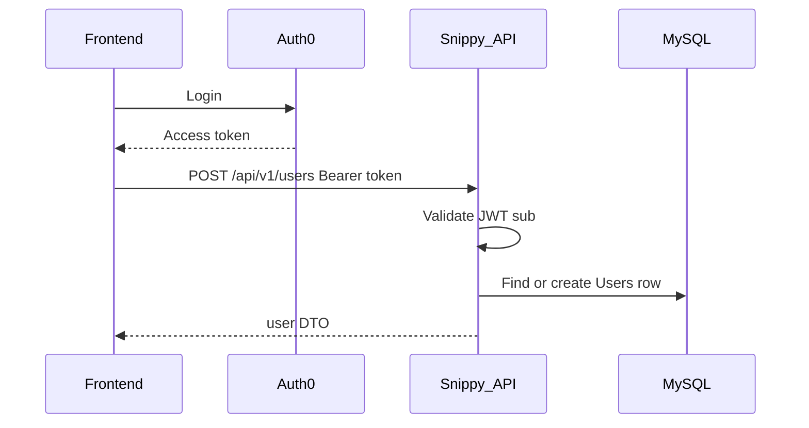

# Snippy Backend Architecture & API Documentation

## Table of Contents

1. [Overview](#overview)
2. [Tech Stack](#tech-stack)
3. [Architecture Layers](#architecture-layers)
4. [Startup Workflow](#startup-workflow)
5. [Database Schema](#database-schema)
6. [Authentication & Authorization](#authentication--authorization)
7. [Middleware](#middleware)
8. [Common Response Shapes](#common-response-shapes)
9. [Pagination](#pagination)
10. [API Quick Reference](#api-quick-reference)
11. [Detailed API Endpoints](#detailed-api-endpoints)
12. [End-to-End Workflows](#end-to-end-workflows)
13. [Environment Variables](#environment-variables)
14. [Operational Notes](#operational-notes)
15. [Debugging](#debugging)

---

## Overview

The Snippy backend is a Node.js / Express REST API that powers a CodePen-like product: users authenticate with Auth0, create HTML/CSS/JS snippets, fork and favorite pens, comment, and optionally upload image assets to MinIO for use as URLs inside snippet HTML/CSS.

**Base URL:** `/api/v1`

**Modules:**

| Module | Mount | Responsibility |
|--------|-------|----------------|
| User | `/users` | Ensure/create profile, update, delete, username check |
| Snippet | `/snippets` | CRUD, fork, search, views, public/private |
| Comment | `/comments` | CRUD on snippet comments |
| Favorite | `/favorites` | List, status check, toggle |
| Resource | `/resources` | MinIO asset list / upload / delete |

**Deployment:**

- **Local development:** root [`docker-compose.yml`](../docker-compose.yml) builds `snippy/backend/Dockerfile.dev` with hot reload (`npm run dev`)
- **Production images:** GitHub Actions builds `snippy/backend/Dockerfile` and pushes to Docker Hub (`kennyl777/snippy-api`)

---

## Tech Stack

| Concern | Choice |
|---------|--------|
| Runtime | Node.js 20 |
| Framework | Express 5 |
| Language | TypeScript |
| ORM / DB | Sequelize-TypeScript + MySQL 8 |
| Auth | Auth0 JWT via `express-oauth2-jwt-bearer` (RS256) |
| Validation | Joi + DOMPurify sanitization |
| Object storage | MinIO (optional, feature-flagged) |
| Uploads | Multer (memory storage) |
| Security | Helmet, CORS, express-rate-limit |
| Logging | Winston-based custom logger |
| API docs (dev) | Swagger UI at `/api-docs` (non-production) |

---

## Architecture Layers

```
Client
  → Middleware (cookie, helmet, CORS, rate limit, Auth0 JWT, JSON body)
  → /api/v1 router
  → Module router + per-route limiter
  → Controller (Joi validate)
  → Service (business rules, ownership, transactions)
  → Repository (Sequelize queries)
  → Entity / MySQL
  ← Mapper → DTO JSON { success: true, ... }
  ← Error handler { success: false, error }
```

### Responsibility breakdown

| Layer | Location | Role |
|-------|----------|------|
| Routes | `modules/*/*.routes.ts` | HTTP method/path + rate limiter |
| Controller | `modules/*/*.controller.ts` | Validate input, call service, send JSON status |
| Validator | `modules/*/*.validator.ts` | Joi schemas + sanitize user text |
| Service | `modules/*/*.service.ts` | AuthZ, privacy, orchestration, transactions |
| Repository | `modules/*/*.repo.ts` | Sequelize CRUD / queries |
| Mapper | `modules/*/*.mapper.ts` | Entity → DTO |
| Entity | `entities/*.entity.ts` | Table definitions and associations |
| Common | `common/` | Auth, errors, pagination, rate limit, logger |

**Do not leak Sequelize entities to clients.** Always return mapped DTOs.

---

## Startup Workflow

Source: [`snippy/backend/src/index.ts`](../snippy/backend/src/index.ts)

1. `validateConfig()` — requires `AUTH0_DOMAIN` and `DB_PASS`
2. Create Express app (`trust proxy = 1`)
3. Mount middleware stack (see [Middleware](#middleware))
4. Mount `/api/v1` routes
5. Mount global error handler
6. Connect MySQL + `sequelize.sync({ force: false })` — **required**; failure exits process
7. If `ENABLE_MINIO=true`, attempt MinIO connect/bucket check and set `featureFlags.isMinioAvailable`
8. Listen on `PORT` (default `3000`)

MinIO failure does **not** stop the API. Resource endpoints return **503** when MinIO is unavailable.

---

## Database Schema

Schema is defined by Sequelize entities and applied with `sequelize.sync({ force: false })`. There is no migration framework yet. [`snippy/db/init.sh`](../snippy/db/init.sh) only creates the database/user grants.

### Entity relationships

```
Users (PK: auth0_id)
  ├── HasMany Snippets
  ├── HasMany Comments
  ├── HasMany Favorites
  └── HasMany Assets

Snippets (PK: snippet_id UUID; unique short_id 7 chars)
  ├── BelongsTo Users (auth0_id, CASCADE)
  ├── BelongsTo parent Snippet via parent_snippet_short_id → short_id (no DB FK)
  ├── HasMany SnippetFiles (unique snippet_id + file_type)
  ├── HasMany Comments
  └── HasMany Favorites

SnippetFiles — html | css | js content per snippet
Comments    — BelongsTo Users + Snippets
Favorites   — unique (auth0_id, snippet_id)
Assets      — BelongsTo Users; unique (auth0_id, object_key)
```

### Entity field highlights

#### Users

| Field | Notes |
|-------|--------|
| `auth0Id` | PK = Auth0 JWT `sub` |
| `userName` | Unique; auto-generated on create if needed |
| `displayName`, `bio`, `pictureUrl` | Profile |
| `isAdmin` | First registered user becomes admin |
| `isPrivate` | Private profiles return 403 to non-owners |

#### Snippets

| Field | Notes |
|-------|--------|
| `snippetId` | UUID — used for update/delete/fork/view/favorites/comments |
| `shortId` | 7-char public id — used for GET by shortId |
| `parentShortId` | Fork parent link |
| `isPrivate` | Owner-only for non-owners |
| Counters | `viewCount`, `forkCount`, `favoriteCount`, `commentCount` (denormalized) |
| `tags` | JSON string array |
| `externalResources` | JSON array of `{ resourceType: 'css'\|'js'\|'other', url }` |

#### SnippetFiles

| Field | Notes |
|-------|--------|
| `fileType` | ENUM `html` \| `css` \| `js` |
| `content` | Source text (not HTML-sanitized) |

#### Assets (MinIO metadata)

| Field | Notes |
|-------|--------|
| `assetId` | UUID — delete by this id |
| `objectKey` | Unencoded MinIO key (`{auth0Sub}/{subFolder}/{fileName}`) |
| `url` | Public path `/content/{urlencodedObjectKey}` |
| `fileName`, `fileType` | Original name + MIME |

Assets are **user-scoped**, not linked to snippets in the DB. Snippets embed asset URLs in HTML/CSS content.

---

## Authentication & Authorization

### Auth0 JWT (global)

Every request under `/api/v1` requires a valid Bearer token:

```
Authorization: Bearer <access_token>
```

Configured in `common/middleware/auth0.service.ts`:

- Audience: `AUTH0_AUDIENCE` (default `http://localhost:3000`)
- Issuer: `https://${AUTH0_DOMAIN}/`
- Algorithm: RS256

User identity: `req.auth.payload.sub` → `auth0Id`.

There is **no anonymous public browse** path. Clients must send a JWT for all API calls (including “public” list/read endpoints).

### Ownership

`AuthorizationService.verifyOwnership` throws **403** when the caller is not the resource owner (snippets, comments, profile mutations).

### Privacy rules

| Resource | Non-owner behavior |
|----------|--------------------|
| Private user profile | 403 on `GET /users/:userName` |
| Private snippet | 403 on GET by shortId, view, comment, favorite (unless owner) |
| Public snippet / profile | Allowed for any authenticated user |
| `GET /snippets/user/:userName` | Returns that user’s **public** snippets only |

---

## Middleware

Order in `index.ts`:

1. Cookie parser
2. Helmet
3. CORS (`FRONTEND_URL`, credentials, `Authorization` header)
4. Global rate limiter (200 / 15 min)
5. `express.json()`
6. Auth0 JWT check
7. `/api/v1` routers (with per-route limiters)
8. Error handler

### Rate limiters (`rate-limit.service.ts`)

| Limiter | Max / 15 min | Used for |
|---------|--------------|----------|
| `globalLimiter` | 200 | All requests |
| `publicReadLimiter` | 150 | GET routes |
| `writeLimiter` | 50 | Mutations |
| `authLimiter` | 20 | `POST /users` |
| `searchLimiter` | 60 | `GET /snippets/search` |

---

## Common Response Shapes

### Success

```json
{ "success": true, "...": "payload fields" }
```

### Error

```json
{ "success": false, "error": "Human-readable message" }
```

### Typical status codes

| Code | Meaning |
|------|---------|
| 200 | OK |
| 201 | Created / favorite toggled |
| 204 | Deleted (empty body) |
| 400 | Validation / bad input |
| 401 | Missing/invalid JWT |
| 403 | Forbidden (ownership or private resource) |
| 404 | Not found |
| 429 | Rate limited |
| 500 | Unexpected server error |
| 503 | MinIO unavailable (resource routes) |

---

## Pagination

Query params on list endpoints:

| Param | Default | Max |
|-------|---------|-----|
| `page` | `1` | — |
| `limit` | `10` | `100` |

Implemented by `PaginationService` (`common/services/pagination.service.ts`).

List responses include `totalCount` (total matching rows, not just page size).

---

## API Quick Reference

All paths are under `/api/v1`. All require `Authorization: Bearer …`.

### Users

| Method | Path | Description |
|--------|------|-------------|
| GET | `/users/check-username/:userName` | Username available? |
| GET | `/users/me` | Current user (owner fields) |
| GET | `/users/:userName` | Public profile by username |
| POST | `/users` | Ensure / create user from Auth0 |
| PUT | `/users` | Update own profile |
| DELETE | `/users` | Delete own account |

### Snippets

| Method | Path | Description |
|--------|------|-------------|
| GET | `/snippets/search` | Search public snippets |
| GET | `/snippets/public` | Paginated public list |
| GET | `/snippets/me` | Current user’s snippets (incl. private) |
| GET | `/snippets/user/:userName` | User’s public snippets |
| GET | `/snippets/:shortId` | Full snippet by short id |
| POST | `/snippets` | Create |
| POST | `/snippets/fork/:snippetId` | Fork by UUID |
| PUT | `/snippets/:snippetId` | Update (owner) |
| POST | `/snippets/:snippetId/view` | Increment view count |
| DELETE | `/snippets/:snippetId` | Delete (owner) |

### Comments

| Method | Path | Description |
|--------|------|-------------|
| GET | `/comments/:snippetId` | List comments |
| POST | `/comments/:snippetId` | Create comment |
| PUT | `/comments/:commentId` | Update own comment |
| DELETE | `/comments/:commentId` | Delete own comment |

### Favorites

| Method | Path | Description |
|--------|------|-------------|
| GET | `/favorites` | List favorited snippets |
| GET | `/favorites/:snippetId` | Is favorited? |
| POST | `/favorites/:snippetId` | Toggle favorite |

### Resources (MinIO)

| Method | Path | Description |
|--------|------|-------------|
| GET | `/resources` | List my assets |
| POST | `/resources` | Upload file (`multipart`) |
| DELETE | `/resources/:assetId` | Delete asset by UUID |

---

## Detailed API Endpoints

### DTOs (reference)

**UserDTO**

```ts
{
  userName: string;
  displayName: string | null;
  bio: string | null;
  pictureUrl: string | null;
  isAdmin?: boolean;      // owner responses only
  isPrivate?: boolean;    // owner responses only
  assets?: AssetDTO[];
}
```

**AssetDTO**

```ts
{
  assetId: string;
  fileName: string;
  fileType: string;
  url: string;
  objectKey?: string;
}
```

**SnippetDTO** — full pen (includes files + external resources)  
**SnippetListDTO** — list card fields (no files)  
**CommentDTO** — `commentId`, `content`, `userName?`, `displayName?`, `isOwner`, timestamps  
**ExternalResource** — `{ resourceType: 'css' | 'js' | 'other', url: string }`

---

### User endpoints

#### `GET /users/check-username/:userName`

**Response `200`:** `{ success: true, available: boolean }`

#### `GET /users/me`

Returns the authenticated user’s profile including `isAdmin`, `isPrivate`, and `assets`.

**Response `200`:** `{ success: true, user: UserDTO }`

#### `GET /users/:userName`

Public profile. Returns **403** if the profile is private and the caller is not the owner.

**Response `200`:** `{ success: true, user: UserDTO }` (without owner-only flags)

#### `POST /users` — Ensure user

Called after Auth0 login to create the DB row if missing, or sync allowed profile fields.

**Body:**

```json
{
  "name": "Optional Display Name",
  "pictureUrl": "https://..."
}
```

- First user in the database is created with `isAdmin: true`
- Username may be auto-generated from adjective+noun helper

**Response:** `200` (existing) or `201` (created) — `{ success: true, user: UserDTO }`

#### `PUT /users`

**Body (all optional):**

```json
{
  "userName": "string",
  "displayName": "string",
  "bio": "string",
  "pictureUrl": "https://...",
  "isPrivate": false
}
```

Cannot change `auth0Id` or `isAdmin`.

**Response `200`:** `{ success: true, user: UserDTO }`

#### `DELETE /users`

Deletes the current user (DB cascades to snippets/comments/favorites/assets rows). MinIO objects are **not** automatically removed yet.

**Response `204`:** empty body

---

### Snippet endpoints

#### `POST /snippets`

**Body:**

```json
{
  "name": "My Pen",
  "description": "optional",
  "tags": ["html", "css"],
  "isPrivate": false,
  "snippetFiles": [
    { "fileType": "html", "content": "<h1>Hi</h1>" },
    { "fileType": "css", "content": "h1 { color: red; }" },
    { "fileType": "js", "content": "console.log('hi')" }
  ],
  "externalResources": [
    { "resourceType": "css", "url": "https://cdn.example.com/lib.css" },
    { "resourceType": "js", "url": "https://cdn.example.com/lib.js" }
  ]
}
```

`fileType` must be `html` | `css` | `js`.

**Response `201`:** `{ success: true, snippet: SnippetDTO }`

#### `GET /snippets/:shortId`

Full snippet including files. Private → owner only (else **403**).

**Response `200`:** `{ success: true, snippet: SnippetDTO }`

#### `PUT /snippets/:snippetId`

Owner only. Same optional fields as create; files may include `snippetFileID` to update an existing file.

Protected (ignored) fields: `snippetId`, `auth0Id`, `shortId`, `parentShortId`.

**Response `200`:** `{ success: true, snippet: SnippetDTO }`

#### `DELETE /snippets/:snippetId`

Owner only. If the snippet is a fork, parent `forkCount` is decremented via parent `shortId` lookup.

**Response `204`:** empty body

#### `POST /snippets/fork/:snippetId`

Forks by **UUID** (`snippetId`), not shortId. Copies files; sets `parentShortId` to the source short id. Cannot fork another user’s private snippet.

**Response `201`:** `{ success: true, snippet: SnippetDTO }`

#### `GET /snippets/me`

Current user’s pens (public + private). Paginated.

**Response `200`:** `{ success: true, snippets: SnippetListDTO[], totalCount: number }`

#### `GET /snippets/public`

All public pens. Paginated.

#### `GET /snippets/user/:userName`

That user’s **public** pens only. Paginated.

#### `GET /snippets/search`

Query: `q` and/or `name` / `description`, plus `page` / `limit`. Searches public snippets.

Empty query returns `{ success: true, snippets: [], totalCount: 0 }`.

#### `POST /snippets/:snippetId/view`

Increments `viewCount` if the snippet is public or owned by the caller. Does **not** return full snippet content.

**Response `200`:** `{ success: true, viewCount: number }`

---

### Comment endpoints

`snippetId` / `commentId` in the path are UUIDs.

#### `GET /comments/:snippetId`

Paginated. Private snippet → owner only.

**Response `200`:** `{ success: true, comments: CommentDTO[], totalCount: number }`

#### `POST /comments/:snippetId`

**Body:** `{ "content": "Nice pen!" }` (required, length-validated)

**Response `201`:** `{ success: true, comment: CommentDTO }`

#### `PUT /comments/:commentId`

Owner only. **Body:** `{ "content": "..." }`

**Response `200`:** `{ success: true, comment: CommentDTO }`

#### `DELETE /comments/:commentId`

Owner only. Decrements snippet `commentCount`.

**Response `204`:** empty body

---

### Favorite endpoints

#### `GET /favorites`

Paginated list of favorited snippets as `SnippetListDTO[]` (includes author `userName` / `displayName`).

**Response `200`:** `{ success: true, snippets: SnippetListDTO[], totalCount: number }`

#### `GET /favorites/:snippetId`

**Response `200`:** `{ success: true, isFavorited: boolean }`

#### `POST /favorites/:snippetId`

Toggle. Creates favorite if missing; deletes if present. Updates snippet `favoriteCount`. Rejects favoriting another user’s private snippet (**403**).

**Response `201`:** `{ success: true, isFavorited: boolean, favoriteCount: number }`

There is **no** separate DELETE route for favorites.

---

### Resource endpoints (MinIO)

Require `featureFlags.isMinioAvailable === true` or return **503**.

#### `GET /resources`

Current user’s assets. Paginated.

**Response `200`:** `{ success: true, assets: AssetDTO[], totalCount: number }`

#### `POST /resources`

`multipart/form-data`:

| Field | Required | Notes |
|-------|----------|-------|
| `file` | yes | Image file |
| `subFolder` | no | Sanitized; default `general` |

**Constraints:**

- Max size: **5 MB**
- Allowed MIME: `image/png`, `image/jpeg`, `image/gif`, `image/webp`, `image/svg+xml`
- Object key: `{auth0Sub}/{subFolder}/{sanitizedFileName}`
- Public URL: `/content/{encodeURIComponent(objectKey)}` (served by nginx in prod when MinIO enabled)

**Response `201`:**

```json
{
  "success": true,
  "message": "File uploaded successfully",
  "url": "/content/...",
  "asset": { "assetId": "...", "fileName": "...", "fileType": "...", "url": "...", "objectKey": "..." }
}
```

#### `DELETE /resources/:assetId`

Deletes MinIO object + DB row. Owner only (**403** otherwise).

**Response `204`:** empty body

---

## End-to-End Workflows

### 1. First login / ensure user



1. User authenticates with Auth0 in the SPA
2. SPA calls `POST /users` with optional `name` / `pictureUrl` from Auth0 profile
3. API creates user (first user = admin) or returns existing profile
4. SPA stores profile and uses token for subsequent calls

### 2. Create → edit → fork → delete snippet

1. `POST /snippets` with name + html/css/js files → receive `snippetId` + `shortId`
2. Navigate / share via `shortId` (`GET /snippets/:shortId`)
3. Owner edits with `PUT /snippets/:snippetId`
4. Another user (or same) forks with `POST /snippets/fork/:snippetId` → new pen with `parentShortId`
5. Owner deletes with `DELETE /snippets/:snippetId` → parent `forkCount` decrements if applicable
6. Optional: `POST /snippets/:snippetId/view` when opening a pen (returns new `viewCount` only)

### 3. Favorite toggle

1. `GET /favorites/:snippetId` → `{ isFavorited }`
2. `POST /favorites/:snippetId` → toggles; response includes `isFavorited` + `favoriteCount`
3. `GET /favorites` → paginated list for the user’s favorites page

### 4. Comment lifecycle

1. `GET /comments/:snippetId?page=1&limit=20`
2. `POST /comments/:snippetId` with `{ content }`
3. Author updates via `PUT /comments/:commentId`
4. Author deletes via `DELETE /comments/:commentId` (204)

### 5. Asset upload → use in HTML → delete

1. Enable MinIO (`ENABLE_MINIO=true`) and ensure bucket/init succeeded
2. `POST /resources` multipart with image → receive `url` like `/content/...`
3. Insert that URL into snippet HTML/CSS (``)
4. `GET /resources` to show the user’s asset list in the UI
5. `DELETE /resources/:assetId` when removing an unused asset

In local `ng serve` without a `/content` proxy, asset URLs only resolve if nginx/MinIO fronting is configured (prod compose / nginx.minio.conf).

---

## Environment Variables

Loaded from the repo root `.env` (Compose `env_file`) or process environment.

### Required

| Variable | Purpose |
|----------|---------|
| `AUTH0_DOMAIN` | Auth0 tenant domain |
| `DB_PASS` | MySQL password for app user |

### Common

| Variable | Default | Purpose |
|----------|---------|---------|
| `PORT` | `3000` | API listen port |
| `NODE_ENV` | `development` | Logging / swagger |
| `DB_NAME` | `snippy` | Database name |
| `DB_USER` | `snippy_api` | DB user |
| `DB_HOST` | `db` | Hostname (Compose service name) |
| `DB_PORT` | `3306` | MySQL port |
| `AUTH0_AUDIENCE` | `http://localhost:3000` | JWT audience |
| `FRONTEND_URL` | `http://localhost:4200` | CORS origin |

### MinIO (optional)

| Variable | Default | Purpose |
|----------|---------|---------|
| `ENABLE_MINIO` | `false` | Enable MinIO bootstrap |
| `MINIO_ENDPOINT` | `minio` | Host |
| `MINIO_PORT` | `9000` | Port |
| `MINIO_USE_SSL` | `false` | TLS |
| `MINIO_APP_USER` | `snippyappuser` | Access key |
| `MINIO_APP_PASSWORD` | (dev default) | Secret key |
| `MINIO_BUCKET` | `content` | Bucket name |

Runtime flag: `featureFlags.isMinioAvailable` — set only after a successful connect when MinIO is enabled.

---

## Operational Notes

### Schema sync

- Production/dev currently use `sequelize.sync({ force: false })`
- New columns/indexes (e.g. Assets `object_key`) are **not** reliably altered on existing volumes
- After Asset model changes locally: recreate the MySQL volume (`docker compose down -v`) or run manual `ALTER TABLE`

### Local vs production Docker

| | Local | Production |
|---|--------|------------|
| Compose | [`docker-compose.yml`](../docker-compose.yml) | [`docker-compose.prod.example.yml`](../docker-compose.prod.example.yml) |
| Backend image | `Dockerfile.dev` + bind mount | `Dockerfile` (compiled `dist/`) |
| Frontend | `ng serve` + proxy `/api` | nginx + runtime `env.js` |

### Known follow-ups (not architectural blockers)

- Introduce Sequelize migrations for safer schema changes
- Delete MinIO objects when a user account is deleted
- Copy `externalResources` on fork
- Optional `/health` endpoint outside JWT for probes
- Improve MinIO put/delete vs DB ordering for orphan cleanup

---

## Debugging

### Swagger

In non-production, open `http://localhost:3000/api-docs` (mounted before JWT).

### Inspect JWT

Decode the access token and confirm:

- `aud` matches `AUTH0_AUDIENCE`
- `iss` is `https://<AUTH0_DOMAIN>/`
- `sub` is the Auth0 user id stored as `auth0Id`

### Curl examples

Replace `$TOKEN` with a valid Auth0 access token.

```bash
# Ensure user
curl -s -X POST http://localhost:3000/api/v1/users \
  -H "Authorization: Bearer $TOKEN" \
  -H "Content-Type: application/json" \
  -d '{"name":"Kenneth"}'

# Current profile
curl -s http://localhost:3000/api/v1/users/me \
  -H "Authorization: Bearer $TOKEN"

# Create snippet
curl -s -X POST http://localhost:3000/api/v1/snippets \
  -H "Authorization: Bearer $TOKEN" \
  -H "Content-Type: application/json" \
  -d '{
    "name":"Hello",
    "snippetFiles":[{"fileType":"html","content":"<h1>Hi</h1>"}]
  }'

# Get by shortId
curl -s http://localhost:3000/api/v1/snippets/$SHORT_ID \
  -H "Authorization: Bearer $TOKEN"

# Toggle favorite
curl -s -X POST http://localhost:3000/api/v1/favorites/$SNIPPET_UUID \
  -H "Authorization: Bearer $TOKEN"

# List comments
curl -s "http://localhost:3000/api/v1/comments/$SNIPPET_UUID?page=1&limit=20" \
  -H "Authorization: Bearer $TOKEN"

# Upload asset (MinIO enabled)
curl -s -X POST http://localhost:3000/api/v1/resources \
  -H "Authorization: Bearer $TOKEN" \
  -F "file=@./image.png" \
  -F "subFolder=general"

# Delete asset
curl -s -o /dev/null -w "%{http_code}\n" -X DELETE \
  http://localhost:3000/api/v1/resources/$ASSET_UUID \
  -H "Authorization: Bearer $TOKEN"
```

### Logs

```bash
docker compose logs api -f
# or grep stack traces
docker compose logs api | grep -i error
```

Logger writes under `src/common/logs/` inside the container/workdir depending on mount.

### Common failures

| Symptom | Likely cause |
|---------|----------------|
| 401 on all routes | Missing/expired Bearer token or wrong audience |
| 403 on snippet/profile | Private resource or not owner |
| 503 on `/resources` | MinIO disabled or connection failed at boot |
| Empty favorites list | Fixed association mapping; rebuild/restart API if on old image |
| Schema / missing column errors | Stale MySQL volume after entity changes — recreate volume |

---

## Summary

The Snippy API is a layered Express/TypeScript service with Auth0 JWT on every `/api/v1` route, Sequelize models for users/snippets/files/comments/favorites/assets, and optional MinIO-backed user assets. Controllers validate, services enforce privacy and ownership inside transactions, repositories talk to MySQL, and mappers emit stable DTOs. Prefer extending modules inside this pattern rather than introducing a new architecture.
